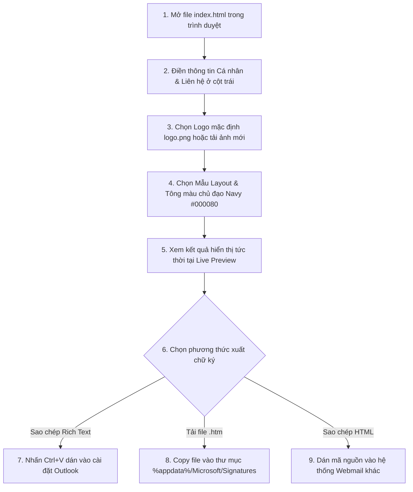

# HƯỚNG DẪN SỬ DỤNG CHI TIẾT (END-TO-END)
## CÔNG CỤ TẠO CHỮ KÝ EMAIL Outlook

Tài liệu này hướng dẫn chi tiết cách vận hành, điền thông tin, tùy chỉnh giao diện và cài đặt chữ ký email xuất bản từ công cụ vào các phiên bản **Microsoft Outlook (Classic & New Outlook)**.

---

## 🗺️ Quy trình hoạt động tổng quan (Workflow)

Dưới đây là quy trình 5 bước từ lúc mở ứng dụng cho đến khi tích hợp chữ ký thành công vào email của bạn:



---

## 📂 Cấu trúc thư mục ứng dụng

Ứng dụng chạy hoàn toàn dưới dạng Single Page Application (SPA), không cần kết nối cơ sở dữ liệu và bảo mật 100% dữ liệu trên máy khách. Các tệp tin cần thiết nằm trong thư mục gốc bao gồm:

*   [index.html](file:///d:/EmailSign/index.html): Tệp tin giao diện chính chứa toàn bộ mã HTML, CSS và logic xử lý JS.
*   `logo.png`: Logo mặc định của doanh nghiệp (được thiết lập kích thước chuẩn **180px** khi mở ứng dụng).
*   `email-message.svg`: Biểu tượng lối tắt (Favicon) của trang web hiển thị trên tab trình duyệt.
*   `outlook_guide.png`: Ảnh chụp thực tế các bước cài đặt chữ ký và thiết lập mặc định trong Outlook.

---

## ✍️ Bước 1: Điền thông tin và tùy chỉnh thiết kế (Cột bên trái)

Giao diện cột trái được chia thành 5 tab chức năng chính, cho phép bạn thiết lập mọi khía cạnh của chữ ký:

### 1. Tab "Cá nhân"
*   **Họ và Tên**: Nhập tên đầy đủ của bạn (được bôi đậm và áp màu chủ đạo trên chữ ký).
*   **Chức vụ / Vị trí**: Vị trí công tác thực tế.
*   **Phòng ban**: Bộ phận phòng ban trực thuộc.
*   **Tên công ty**: Tên pháp nhân cơ quan doanh nghiệp.

### 2. Tab "Liên hệ"
*   **Điện thoại di động (Mobile)**: Số điện thoại di động cá nhân (hiển thị dưới dạng `M: [Số điện thoại]`).
*   **Địa chỉ Email**: Hòm thư cơ quan. Tự động tạo liên kết `mailto:` khi click.
*   **Trang web (Website)**: Tên miền website doanh nghiệp. Tự động chuẩn hóa liên kết `https://`.
*   **Địa chỉ (Address)**: Địa chỉ nơi làm việc trực thuộc.
> [!NOTE]
> Trường "Điện thoại cơ quan (Phone)" đã được lược bỏ để giảm thiểu tối đa sự rườm rà, tập trung hiển thị các thông tin liên hệ chính.

### 3. Tab "Mạng xã hội"
*   Điền đường link profile của các mạng xã hội phổ biến: **LinkedIn**, **Facebook**, **Twitter/X**, **Instagram**. 
*   Nếu để trống trường nào, biểu tượng tương ứng của mạng xã hội đó sẽ tự động ẩn đi để tối ưu không gian.

### 4. Tab "Hình ảnh"
*   **Logo mặc định**: Ứng dụng nạp trực tiếp ảnh `logo.png` trong thư mục của bạn để làm biểu tượng mặc định.
*   **Tùy biến nguồn ảnh**:
    *   *Link ảnh Online*: Bạn có thể nhập/dán bất kỳ đường dẫn URL ảnh nào trực tuyến (Ví dụ: từ máy chủ ảnh công ty).
    *   *Tải ảnh lên từ máy tính*: Bạn có thể kéo thả tệp ảnh hoặc nhấn để duyệt file. Ảnh tải lên sẽ được chuyển đổi tự động sang định dạng Base64 và nhúng trực tiếp vào mã nguồn.
*   **Kích thước & Bo góc**:
    *   Thanh trượt **Kích thước** cho phép điều chỉnh độ rộng của logo (Mặc định tối đa **180px**).
    *   Thanh trượt **Bo góc** hỗ trợ bo tròn các góc của logo từ hình vuông (`0px`) đến hình tròn (`90px`).

### 5. Tab "Mẫu & Kiểu dáng"
*   **Chọn mẫu thiết kế**: Hỗ trợ 3 mẫu layout chuẩn chuyên nghiệp:
    *   *Mẫu 1 (Classic Split)*: Chia đôi cổ điển. Logo nằm bên trái, phân cách với thông tin bên phải bằng một đường kẻ đứng màu xanh Navy.
    *   *Mẫu 2 (Modern Stack)*: Layout hiện đại. Logo nằm trên cùng, thông tin cá nhân và liên hệ được xếp dọc bên dưới.
    *   *Mẫu 3 (Compact Badge)*: Logo nằm gọn gàng góc trái, tên và chức vụ nổi bật ở trên, thông tin liên hệ được tối ưu nhỏ gọn phía dưới.
*   **Màu chủ đạo**:
    *   Màu chủ đạo mặc định là **Navy Blue (#000080)**.
    *   Bạn có thể nhấp chọn các ô màu preset có sẵn hoặc sử dụng bộ chọn bảng màu (Color Picker) để chỉnh màu chính xác theo nhận diện thương hiệu mong muốn.
*   **Font chữ chữ ký**: Chọn một trong các font chữ web an toàn, hiển thị ổn định nhất trên các bộ máy đọc email của Outlook như: *Calibri (Khuyên dùng)*, *Segoe UI*, *Arial*, *Verdana*, *Georgia*, *Times New Roman*.
*   **Kích thước chữ**: Tùy chỉnh cỡ chữ của chữ ký (12px, 14px, hoặc 16px).

---

## 🖥️ Bước 2: Xem kết quả (Cột bên phải)

*   Cột bên phải đóng vai trò là một cửa sổ giả lập soạn thảo email trong Outlook thời gian thực. Mọi ký tự bạn điền hoặc thanh trượt bạn co kéo ở cột trái sẽ lập tức cập nhật tương ứng tại đây.
*   Cột bên phải được thiết lập **cố định (Sticky)** khi bạn cuộn trang web xuống dưới để điền bảng hướng dẫn, giúp bạn luôn quan sát được kết quả một cách trực quan nhất.

---

## 📥 Bước 3: Xuất và cài đặt chữ ký vào Outlook

Công cụ cung cấp 3 nút chức năng xuất bản ở chân cột bên phải:

### Cách 1: Sử dụng tính năng Copy Rich Text (Khuyên dùng - Đơn giản nhất)

Đây là phương thức sao chép định dạng văn bản giàu thuộc tính, giúp giữ nguyên toàn bộ bố cục bảng biểu, màu sắc và hình ảnh khi dán trực tiếp.

#### A. Đối với phiên bản New Outlook và Outlook Web (O365)
1. Nhấn nút **"Sao chép Chữ ký (Rich Text)"** ở cột bên phải. Ứng dụng sẽ hiển thị thông báo đã sao chép.
2. Mở ứng dụng **New Outlook** trên máy tính hoặc truy cập **Outlook Web** qua trình duyệt.
3. Nhấp vào biểu tượng **Cài đặt (răng cưa)** ở góc trên bên phải màn hình (hoặc vào menu **File** > **Settings**).
4. Đi tới danh mục: **Accounts (Tài khoản)** > **Signatures (Chữ ký)**.
5. Nhấp chọn nút **+ Add signature (Thêm chữ ký)** và đặt một tên gợi nhớ cho chữ ký của bạn.
6. Click chuột vào khung soạn thảo nội dung lớn ở bên dưới, nhấn tổ hợp phím **`Ctrl + V`** để dán chữ ký.
7. Thiết lập tích chọn làm mặc định cho thư mới / thư phản hồi (Xem thêm hình ảnh hướng dẫn có khoanh đỏ ở tab *New Outlook / Outlook Web* trong phần hướng dẫn của ứng dụng).
8. Nhấn **Save (Lưu)** để hoàn thành.

#### B. Đối với phiên bản Outlook Desktop (Classic - Bản cổ điển)
1. Nhấn nút **"Sao chép Chữ ký (Rich Text)"**.
2. Mở phần mềm **Microsoft Outlook** cổ điển trên máy tính.
3. Đi tới: **File** > **Options** > **Mail** > click chọn nút **Signatures...**
4. Tại tab *Email Signature*, nhấp nút **New** để tạo chữ ký mới, đặt tên và nhấn OK.
5. Click vào khung soạn thảo văn bản trắng ở dưới cùng, nhấn **`Ctrl + V`** để dán chữ ký của bạn vào.
6. Tại góc trên bên phải, thiết lập phần *Choose default signature* cho tài khoản email tương ứng.
7. Nhấn **Save** và nhấn **OK**.

---

### Cách 2: Tải file `.htm` và chèn thủ công (Dành cho phiên bản Outlook Desktop Windows)

Cách này đặc biệt hữu dụng khi sao chép trực tiếp bị lỗi phông chữ hoặc hình ảnh trên một số hệ điều hành cũ.

1. Nhấp nút **"Tải file .htm (Outlook)"** ở cột bên phải để tải tệp tin chứa mã chữ ký chuẩn xuống máy tính. Tệp tải về sẽ có tên mặc định là `signature.htm`.
2. Đóng hoàn toàn phần mềm Outlook.
3. Nhấn tổ hợp phím **`Windows + R`** trên bàn phím để mở hộp thoại *Run*.
4. Dán chính xác đường dẫn thư mục chữ ký sau đây vào và nhấn **Enter**:
   ```
   %appdata%\Microsoft\Signatures
   ```
5. Kéo và thả file `signature.htm` bạn vừa tải về vào thư mục vừa mở ra.
6. Mở lại ứng dụng **Outlook Desktop**. Chữ ký mới sẽ tự động được nhận diện và hiển thị trực tiếp trong danh sách quản lý chữ ký của bạn tại mục *File > Options > Mail > Signatures...*. Bạn chỉ cần chọn nó làm mặc định.

---

### Cách 3: Sao chép mã nguồn HTML (Dành cho các nền tảng Webmail khác)

Nếu bạn muốn cấu hình chữ ký trên các nền tảng như Gmail, Thunderbird hoặc hệ thống quản lý CRM:
1. Nhấn nút **"Sao chép Mã HTML"**.
2. Dán mã nguồn HTML đã copy vào bộ soạn thảo mã (Source Code / HTML view) của hệ thống tương ứng.

---

## 🔒 Cam kết bảo mật dữ liệu

> [!IMPORTANT]
> Ứng dụng này hoạt động dựa trên triết lý **Serverless SPA**. Mọi thông tin cá nhân, số điện thoại, địa chỉ email hay tệp tin ảnh logo bạn tải lên đều được xử lý cục bộ ngay trên bộ nhớ trình duyệt của bạn (Client-side rendering). Không có bất kỳ dữ liệu nào được tải lên máy chủ hoặc gửi đi bên ngoài, đảm bảo an toàn thông tin tuyệt đối 100%.
